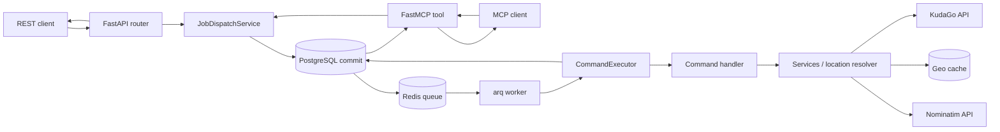

# Architecture

## Components

| Layer | Responsibility |
|---|---|
| `api/routers` | HTTP routes, dependencies and response mapping |
| `mcp` | agent schemas, mappers, serializers, FastMCP tools and envelopes |
| `application` | shared command contracts, `CommandExecutor` and handlers |
| `schemas` | Pydantic request and response contracts |
| `services` | reusable business rules and integration orchestration |
| `repositories` | asynchronous SQLAlchemy operations |
| `models` | PostgreSQL tables |
| `workers` | arq background jobs |
| `integrations` | independent KudaGo, Nominatim, Transitous and OpenRouteService HTTP clients |
| `core` | configuration, database engine and Redis pool |

## Shared Queued Command Flow

```text
REST ─┐
      ├→ api_request → job → Redis → arq → CommandExecutor
MCP ──┘

REST → queued response
MCP  → await worker → load persisted CommandOutput → MCP serializer → result
```

Both transports use `JobDispatchService`. It creates the `api_request`, job and
`queued` event, commits PostgreSQL, and only then enqueues
`process_command_job` in Redis. After enqueue succeeds, it saves
`queue_job_id`, adds the `enqueued` event and commits again. A Redis failure or
duplicate arq job ID marks the persisted job `failed` with an
`enqueue_failed` event instead of leaving it queued forever.

The worker receives only `job_id`; the authoritative application command and
payload are loaded from PostgreSQL. It records `started`, executes the shared
`CommandExecutor`, persists `command_results` and diagnostics, and finishes
with `completed` or `failed`.



## MCP Command Flow

MCP tools validate and map agent-facing inputs, then use the same dispatcher and
worker as REST. The MCP process never invokes application handlers or external
APIs directly:

```text
MCP client
  -> FastMCP tool over /mcp or stdio
  -> agent schema validation and application-payload mapping
  -> create and commit job with method=MCP
  -> enqueue process_command_job
  -> close DB session
  -> await ArqJob.result()
  -> open a new DB session and load job + command_result
  -> agent serializer and response-size cap
  -> return the MCP envelope
```

Timeout does not cancel the queued job, and client cancellation is not
translated to `ArqJob.abort()`. There is no inline fallback when Redis or the
worker is unavailable. MCP serializers never mutate the persisted
`CommandOutput.result_payload`.

Routing follows the same queue. Both REST and MCP enqueue
`routing.transit.plan` or `routing.street.plan`; `TransitRoutingService` and
`StreetRoutingService` normalize provider responses and write `upstream_calls`
inside the worker, while `CommandExecutor` owns the common result and event
lifecycle. Neither routing service invokes the other or performs geocoding.

## Synchronous Reads

REST reference and object-detail GET endpoints intentionally remain direct,
synchronous and untracked. They do not create jobs or write diagnostics. MCP
`get_details` is tracked through the queued command flow; reference data is a
committed schema snapshot and has no public MCP tool.

Небольшие справочные и detail-запросы выполняются без Redis:

```text
router -> service -> KudaGo -> response
```

К ним относятся `/references/*` и `/objects/{type}/{id}`.

## Location Resolution

`LocationResolverService` унифицирует обработку географии:

1. Явный KudaGo `location` используется без геокодирования.
2. Явные координаты разрешены для events и places.
3. `place_query` сначала сопоставляется со справочником locations KudaGo.
4. Если соответствия нет, используется Nominatim и geo cache.
5. Endpoint получает один из статусов `ok`, `geo_ambiguous`,
   `geo_not_found` или `geo_unsupported`.

Movies, movie showings, news и lists не поддерживают координаты и требуют
KudaGo location slug или подходящий ID объекта.

## Persistence

| Table | Stored data |
|---|---|
| `api_requests` | исходный HTTP-запрос и команда |
| `jobs` | состояние, входные данные, итог и ошибка |
| `job_events` | хронология выполнения |
| `command_results` | полные массивы результатов и metadata |
| `upstream_calls` | параметры, ответы, время и ошибки внешних API |
| `geo_cache` | переиспользуемые результаты Nominatim |

## Result Strategy

`GET /jobs/{id}` возвращает компактный `result_payload`: массивы `items` и
`routes` заменяются на count/hidden-поля и подсказку. Полный результат доступен
через `/results` или `?include_result=true`.

The MCP facade applies a second, agent-specific view only after persistence.
Search/list data is limited to 64 KiB and routing data to 128 KiB. Whole items
or route alternatives are removed from the end; full command results and
upstream diagnostics remain unchanged in PostgreSQL.

## Failure Model

- Ошибка внешнего API переводит job в `failed` и сохраняется в job events и
  upstream calls.
- Ошибка постановки в Redis переводит уже закоммиченную job в `failed` и
  добавляет `enqueue_failed`.
- Неоднозначный или отсутствующий geo result считается обработанным результатом:
  job получает `succeeded`, а `result_payload.status` объясняет ограничение.
- Кэшированные geo results не появляются в upstream calls, потому что внешнего
  HTTP-вызова в этом случае нет.
- `no_route` is a completed domain result, so the job is `succeeded`.
  Timeouts, transport failures, HTTP 429/5xx, invalid provider responses and
  routing configuration failures make the job `failed`.
