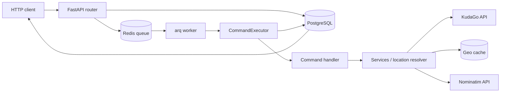

# Architecture

## Components

| Layer | Responsibility |
|---|---|
| `api/routers` | HTTP routes, dependencies and response mapping |
| `mcp` | FastMCP HTTP/stdio transport, tools and MCP response envelopes |
| `application` | shared command contracts, `CommandExecutor` and handlers |
| `schemas` | Pydantic request and response contracts |
| `services` | reusable business rules and integration orchestration |
| `repositories` | asynchronous SQLAlchemy operations |
| `models` | PostgreSQL tables |
| `workers` | arq background jobs |
| `integrations` | independent KudaGo, Nominatim, Transitous and OpenRouteService HTTP clients |
| `core` | configuration, database engine and Redis pool |

## Queued Command Flow

```text
POST /api/v1/events/search
  -> validate EventsSearchRequest
  -> save api_request and queued job
  -> enqueue process_events_search_job in Redis
  -> return job_id

arq worker
  -> mark job running
  -> CommandExecutor
  -> command handler
  -> services
  -> call KudaGo and optionally Nominatim
  -> record upstream_calls
  -> save command_results and job_events
  -> mark job succeeded or failed

client
  -> GET /api/v1/jobs/{job_id}
  -> GET /api/v1/jobs/{job_id}/results
```



## MCP Command Flow

MCP tools use the same executor and handlers, but execute inline instead of
using Redis and the arq worker:

```text
MCP client
  -> FastMCP tool over /mcp or stdio
  -> create job with method=MCP
  -> CommandExecutor inline
  -> command handler
  -> services
  -> KudaGo / Nominatim
  -> upstream_calls + command_results + job_events
  -> commit diagnostics and return the MCP envelope
```

The shared command layer keeps transport-specific code limited to validation,
job submission/execution mode, and response mapping.

Routing follows the same split. REST endpoints enqueue
`routing.transit.plan` or `routing.street.plan`; MCP tools execute those exact
commands inline. `TransitRoutingService` and `StreetRoutingService` normalize
provider responses and write `upstream_calls`, while `CommandExecutor` owns the
common job, result and event lifecycle. Neither routing service invokes the
other and neither performs geocoding.

## Synchronous Reads

REST reference and object-detail GET endpoints intentionally remain direct,
synchronous and untracked. They do not create jobs or write diagnostics. The
equivalent MCP tools are always tracked through the inline command flow above.

Небольшие справочные и detail-запросы выполняются без Redis:

```text
router -> service -> KudaGo -> response
```

К ним относятся `/references/*` и `/objects/{type}/{id}`.

## Location Resolution

`LocationResolverService` унифицирует обработку географии:

1. Явный KudaGo `location` используется без геокодирования.
2. Явные координаты разрешены для events и places.
3. `place_query` сначала сопоставляется со справочником locations KudaGo.
4. Если соответствия нет, используется Nominatim и geo cache.
5. Endpoint получает один из статусов `ok`, `geo_ambiguous`,
   `geo_not_found` или `geo_unsupported`.

Movies, movie showings, news и lists не поддерживают координаты и требуют
KudaGo location slug или подходящий ID объекта.

## Persistence

| Table | Stored data |
|---|---|
| `api_requests` | исходный HTTP-запрос и команда |
| `jobs` | состояние, входные данные, итог и ошибка |
| `job_events` | хронология выполнения |
| `command_results` | полные массивы результатов и metadata |
| `upstream_calls` | параметры, ответы, время и ошибки внешних API |
| `geo_cache` | переиспользуемые результаты Nominatim |

## Result Strategy

`GET /jobs/{id}` возвращает компактный `result_payload`: массивы `items` и
`routes` заменяются на count/hidden-поля и подсказку. Полный результат доступен
через `/results` или `?include_result=true`.

## Failure Model

- Ошибка внешнего API переводит job в `failed` и сохраняется в job events и
  upstream calls.
- Неоднозначный или отсутствующий geo result считается обработанным результатом:
  job получает `succeeded`, а `result_payload.status` объясняет ограничение.
- Кэшированные geo results не появляются в upstream calls, потому что внешнего
  HTTP-вызова в этом случае нет.
- `no_route` is a completed domain result, so the job is `succeeded`.
  Timeouts, transport failures, HTTP 429/5xx, invalid provider responses and
  routing configuration failures make the job `failed`.
